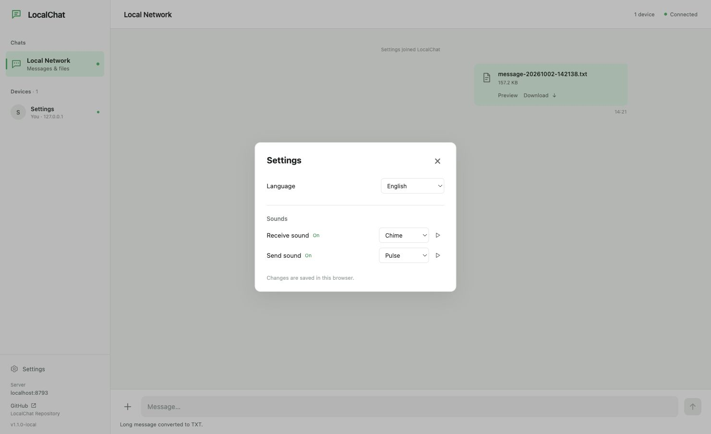
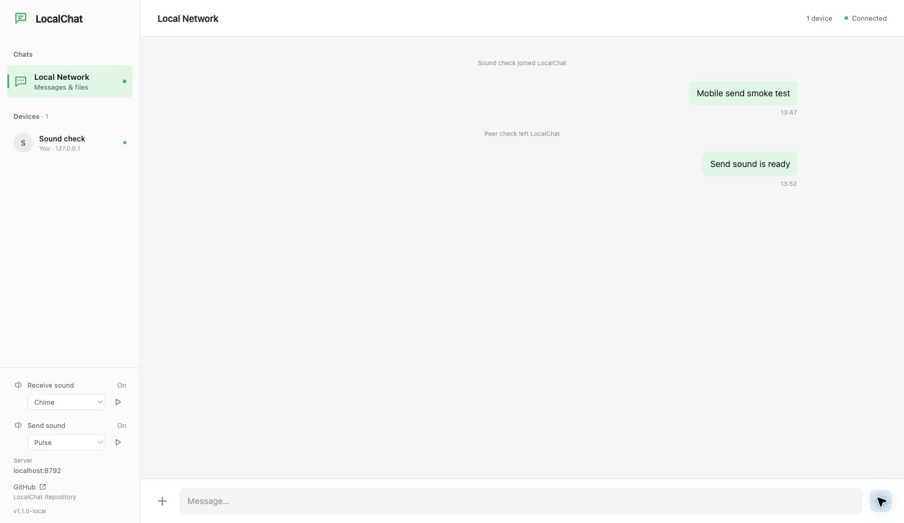
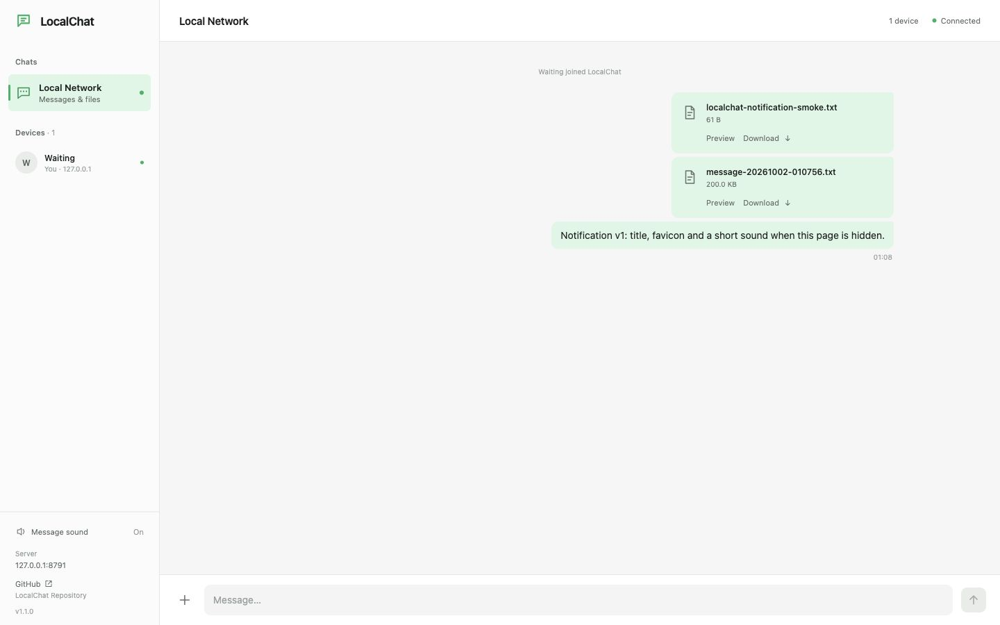

# LocalChat 验证记录

日期：2026-10-01。执行环境为 macOS；浏览器客户端在同一台机器上分别使用 `127.0.0.1` 与 `localhost`。以下记录区分真实浏览器/HTTP 测试与网络故障模拟，不把跨平台编译当作异系统实机验证。

## 设置入口与中英文验证（本地验收）

日期：2026-10-02。声音设置收进左下角 Settings 弹窗，增加 English / 简体中文切换。没有修改 Go 源码、协议、上传实现、依赖或 CI / Release 工作流。

- 首次进入真实 Edge 新预览端口，界面与设置默认英文；语言选择保存为 `localchat.language`，同步更新 HTML lang。刷新保留中文和原来的声音开关、音色，不自动按操作系统语言切换。
- 37 项前端测试通过，新增覆盖默认/无效语言、持久化、响应式更新、插值、常见错误/系统事件、存储不可用。Vue / TypeScript 构建、`go test ./...`、`go vet ./...`、`go build ./cmd/localchat` 通过。
- 切换中文时原消息内容、名为 Settings 的用户名和 Draft stays unchanged 草稿保持原文；对该切换区间观察 WebSocket created / closed 事件均为空，没有刷新或重新连接。
- 背景聊天区域 inert；Tab / Shift+Tab 在设置中循环，禁用的试听按钮不参加循环。Esc 关闭后桌面焦点回到 Settings；移动端打开设置时关闭 Drawer，退出后焦点回到菜单按钮。
- 设置中实际试听和切换音色，原生 Analyser 测得约 0.0699 峰值；发送/接收独立开关与五种音色保留。测量注入随刷新移除。
- 中文界面通过真实 TXT 上传发送 161,000 字节，完成状态、文件消息与预览按钮翻译正常；预览保留原始英文内容和文件名，读取长度为 161,000，Copy / Close / Download 显示中文。
- 390 × 844 Smoke Test：文档宽度 390，设置宽 350，没有横向溢出。Drawer → Settings、语言切换、关闭和焦点恢复正常；视口覆盖已清除。
- 新预览为 `localhost:8793`，版本 `v1.1.0-local`；用户已有服务未重启。验收后预览恢复 English、两路 On 和 Chime / Pulse。以上验收在提交、推送与创建版本 Tag 之前完成。



## 发送声音与五种音色验证（本地验收）

日期：2026-10-02。保留前一轮声音修复，增加独立的发送开关、发送/接收音色选择和试听。没有修改 Go 源码、上传实现、消息协议、Composer、依赖或 CI / Release 工作流。

- 发送音默认开启，在自己的 text / file 服务端回显确认后播放；失败、分片、进度和系统事件静默。自己消息始终不增加未读数、不改变标题或 favicon。
- 发送与接收分别选择 Chime / Pulse / Bell / Drop / Wood。每种音色有不同的发送上行与接收下行双音，完全本地合成，没有音频文件下载。每路独立静音、400ms 节流和延迟播放取消；两路开关与选择持久化，原有接收静音设置保留。
- 33 项前端测试通过，覆盖原有聊天呈现、TXT、上传、通知，以及五种音色、两路独立静音、默认值/未知值回退、持久化、延迟取消和真实 WebSocket composable 的确认/失败路径。Vue / TypeScript 构建、`go test ./...`、`go vet ./...`、`go build ./cmd/localchat` 通过。
- 真实 Edge 测试页面通过原生 Analyser 测得十组发送/接收试听波形峰值约 0.067–0.070；各组频率/波形组合不同。自己的前台文字收到回显后产生一组双音；关闭发送音后消息仍显示且没有新声音节点。
- 通过现有输入框发送约 206 KB 的长文本，实际 HTTP 分片/完成和 Go WebSocket 文件广播通过，自己的文件完成后恰好一组发送音，title 仍为 LocalChat。浏览器扩展未开启 file URL 访问，自动填入本地文件被扩展限制；未修改权限，文件路径通过实际生成 TXT 上传验证，不将其记为本地文件选择自动验收通过。
- 真实后台接收另一客户端文字时使用下行接收音且标题为 `(1) LocalChat`；回到页面清零。刷新后 Send Off 与 Bell 选择保留，测量注入随刷新移除，验收后恢复预览页面默认的 Chime / Pulse 与两个 On。
- 390 × 844 Smoke Test：文档宽 390，无横向溢出；Drawer、音色选择、试听、关闭和消息发送正常，Footer 底部为 844。验收后清除视口覆盖。
- 独立预览服务为 `localhost:8792`，版本 `v1.1.0-local`；现有用户服务未重启。以上验收在提交、推送与创建版本 Tag 之前完成。



## 声音修复验证（本地验收）

日期：2026-10-02。修复仅涉及通知 composable、回归测试、内嵌前端产物及说明文档；没有修改 Go 源码、聊天协议、UI 布局或 CI / Release。

- 前台条件改为页面 visible 且窗口有焦点，覆盖切换 IDE / Terminal 后页面仍 visible 的情况；返回窗口时清除未读并停止声音。
- 开启 Message sound 会播放一次试听；已由用户操作解锁的音频上下文被浏览器暂停后尝试恢复，返回聊天或静音会取消尚未播放的提示。
- 双音总长约 305ms，安排 25ms 渲染提前量，峰值增益为 0.07；400ms 节流和自己消息静默保持。
- 26 项前端测试、Vue / TypeScript 构建、`go test ./...`、`go vet ./...`、`go build ./cmd/localchat` 通过。新增回归覆盖 visible 但失焦、试听、暂停恢复以及延迟播放取消。
- 真实 Edge 独立窗口关闭自动化 focus emulation 后，原生状态为 hidden / 未聚焦。真实 Go WebSocket 对方消息触发 `(1) LocalChat`，返回窗口恢复 `LocalChat`；试听及后台消息均在原生 Analyser 测得约 0.0699 的非零音频峰值，没有模拟 visibilityState。音频波形验证不等同于用户扬声器的人工听感验收；visible / 失焦分支由回归测试覆盖。
- `localhost:8791` 更新为本地修复版 `v1.1.0-local`。测试窗口、测试连接及音频测量注入已清理；以上验收在提交、推送与创建版本 Tag 之前完成。

## v1.1.0 Notification v1 验证

日期：2026-10-02，macOS。只增加客户端通知 composable、接收后的通知调用和 Sidebar Footer 的 Message sound 开关。Go 源码、协议、上传/下载/预览、Composer、依赖及 CI / Release 工作流没有修改。

- 23 项前端测试通过，包含原有 17 项及新增 6 项通知测试。实际 notification / WebSocket composable 覆盖前台静默、同名不同连接、旧/新自己连接、非消息事件、99+、静音持久化、刷新清零、音频缺失/策略拒绝、画布/存储失败、异步图标加载与 unmount 清理。
- `npm run build`、`go test ./...`、`go vet ./...`、`go build ./cmd/localchat` 通过。
- 内置浏览器点击发送后 Web Audio Context 从 suspended 到 running。前台对方消息正常显示，title / favicon 不变；通知声音用原生图中的两个 Oscillator / Gain 节点验证，不把节点观察当作人工听感验收。
- 内置浏览器在切换自身标签页后仍报告 visible，因此后台/返回场景通过 CDP 在隔离测试页面模拟 visibilityState / visibilitychange。测试页面正常接收真实 Go 服务的 WebSocket 广播，未直接调用通知 helper；模拟随后随刷新移除，不修改产品代码。标题依次为 (1)、(2)，favicon 为实际 Canvas PNG；自己后台的回显以及 join / leave 不增加未读，恢复 visible 后立即清零。
- 隔离服务通过 64 个真实 HTTP PUT 上传恰好 1 GiB（二进制内容全零），每片 16 MiB；在第 32、第 64 片后，title 均为 LocalChat，原 favicon 保持，未创建 Oscillator。POST complete 后，文件卡片为 1.00 GB，title 为 (1)，红点出现，恰好创建一组双音；所有测试文件随隔离服务正常退出清理。
- 关闭声音后接收真实消息，title 仍增加且不再创建声音节点。刷新保留 Off、清除未读。测试页禁用 Web Audio 后重新开启声音，真实消息继续显示且 title / favicon 继续正常，控制台无 error / warn；随后刷新恢复原生 API。
- 390 × 844 Smoke Test：文档宽 390，无横向溢出；Drawer 和 Message sound On / Off 正常，开关不遮挡主聊天界面。完成后恢复桌面视口。
- 最终注入 v1.1.0 的原生二进制中，实际文件选择/上传、61 字节文件预览与下载、200 KiB 自动 TXT 上传和普通文字发送通过；自己消息未改变 title。六平台压缩包和 SHA-256 本地校验通过。
- 未引入音频素材、通知/音频/Canvas 依赖、系统通知权限、Service Worker 或云服务。实际浏览器对后台冻结/休眠、露出窗口的可见性及 autoplay 的处理仍以该浏览器为准；后端和聊天不依赖通知能力。



## v1.0.0 离线预览与长文本验证

日期：2026-10-02，macOS。Sidebar、Header、消息布局、Composer 主结构、依赖和两个 GitHub Actions 工作流保持本轮修改前的版本。

- `npm ci`、17 项前端测试、`npm run build`、`go test ./...`、`go test -race ./...`、`go vet ./...`、`go build ./cmd/localchat` 通过。原有队列、16 MiB 分片、四并发、Pause / Resume / Retry / Cancel、下载与清理测试均保留。
- 后端真实 HTTP 测试覆盖 TXT、LOG、JSON、Go、HTML / HTM、ENV、Dockerfile、Makefile、空文本、无效 UTF-8、PNG、PDF，以及伪装文件、二进制文本、SVG、ZIP、EXE、DOCX。预览 metadata 与响应类型一致，下载字节及 attachment 行为不变，原生媒体 HEAD / Range 正常。
- 780 MiB 稀疏日志走实际磁盘/HTTP 路径，返回前 524,288 字节；Range 不能绕过上限。HEAD 预览长度为 512 KiB，Download HEAD 仍为完整大小。该请求 Go 堆累计分配预算小于 32 MiB，避免完整读取 780 MiB 后再截断的回归。稀疏 fixture 不代表再次完成 780 MiB 的真实浏览器上传。
- WebSocket 覆盖恰好 128 KiB UTF-8 内容、最坏 JSON 转义，以及超过边界拒绝。前端覆盖 64 / 128 KiB 精确边界、中文和 emoji 字节数、短代码保持消息、生成 TXT 的时间戳和逐字节内容。
- 真实浏览器选择并上传 TXT、LOG、JSON、Go、PNG、PDF、HTML、ZIP、SVG 与超过 512 KiB 的日志。文本以 monospace 显示；HTML 只有源码，无 script 节点、无标题修改；ZIP / SVG 不显示 Preview。日志 Dialog 只有 524,288 个 ASCII 字符并显示截断提示。
- PNG 原生预览尺寸为 800 × 400，不撑破 Dialog；Copy 成功。PDF 的响应为 inline / application/pdf，Dialog 使用原生新标签页入口，不引入解析器。当前内置浏览器无法显示嵌入 PDF，因此保留明确说明与 Download fallback；未将其计为 PDF 页面渲染通过。
- 10 KiB 走普通消息；80 KiB 显示 Message / TXT 两个选择，并分别验证；200 KiB 自动上传 TXT，清空输入，预览长度正确，下载与原始文本逐字节一致。
- 在独立测试服务的临时目录注入不可写故障：TXT 初始化失败后 200 KiB 原文仍在 Composer、File 保留并出现 Retry。恢复权限后 Retry 上传成功，原文仍保留供用户处理；没有读取或改变用户文件。
- 实际重启独立测试服务后，旧文件 Preview 显示 File is no longer available，Download 显示过期提示，没有空白错误 Dialog。
- 390 × 844 Smoke Test：预览 Dialog 宽 390、高 844，长文本提示和文件卡片无横向溢出，关闭与 TXT 发送正常；测试后恢复视口。
- `VERSION=v1.0.0 ./scripts/build-release.sh` 完成六平台编译与打包；名称、仅单个程序内容、Unix 执行权限、六项 SHA-256 和实际 Sidebar / API 的 v1.0.0 版本验证通过。跨平台实机与浏览器 PDF 能力仍取决于对应设备。


## UI Polish、CI 与 Release 验证

本轮只调整侧栏底部与 Composer 宽度，保留消息布局、配色、WebSocket 和文件传输实现。

- `npm ci`、11 项前端测试、Vue/TypeScript 构建、`go test ./...`、`go vet ./...`、`go build ./cmd/localchat` 通过。
- `/api/info` 测试覆盖默认 `dev` 与注入版本 `v0.2.0`，同时保留已有文件限制字段。实际启动注入版本的 macOS 二进制，横幅与 API 均为 `v0.2.0`。
- 六个平台均以 `CGO_ENABLED=0` 编译；版本化压缩包名称、单个程序内容、Unix 执行权限与六项 SHA-256 校验通过。macOS 打包禁用 AppleDouble 隐藏元数据。打包版本与编译版本不一致时明确拒绝。
- `actionlint v1.7.12` 检查两个工作流通过；CI 仅 main push / PR，Release 仅版本 Tag push。未创建正式 Tag 或 Release 来验证发布。
- 1440 × 900 桌面：侧栏 230px，Waiting 仅在 Devices 出现一次，保留 You；Footer 显示 Server、真实仓库链接与 API 版本。GitHub 链接为 `_blank`、`noopener noreferrer`。Devices 中点击自己仍能打开改名对话框并保存。
- 主面板宽 1210px，Composer 内部宽 1170px（左右各 20px），高度保持 73px；消息流仍为 960px。
- 两个浏览器客户端正常发送、接收消息；实际选择 64 字节测试文件，上传与对方下载成功，下载与源文件逐字节一致。
- 390 × 844 Smoke Test：文档宽度 390，无横向溢出，Header、消息、Drawer 打开/关闭、输入、发送和文件选择/上传通过；测试后恢复视口设置。

当前桌面与移动端截图已更新。Windows、Linux、Apple Silicon 仍为交叉编译验证，未做异系统实机运行；正式发布及资产上传将由下一次版本 Tag 触发。

## 自动检查

```sh
go test -race ./...
go vet ./...
cd web
npm test
npm run build
```

已通过后端 5 组测试（含多个输入边界案例）及前端 6 组上传测试，Go 竞态检查和 vet 无报错，Vue/TypeScript 生产构建成功。发布脚本使用 `CGO_ENABLED=0` 完成五个平台构建并输出 SHA-256 清单。

后端使用真实 `httptest` HTTP / WebSocket 连接，覆盖：

- 两个客户端的广播、改名、在线人数、服务器提供的 IP/时间、忽略伪造身份、非法 JSON 与超长内容拒绝，以及新页面不接收历史。
- IPv4、IPv6、IPv6 zone 与无效 RemoteAddr 解析。
- 并行发送 16 MiB 分片与末片；完成前拒绝缺片；成功分片重传和完成请求重传幂等；完成后仅广播一次。
- 流式文件合并、原文件字节比对、中文下载名、Content-Length、Range 返回 206、删除 .part、禁止取消已分享文件。
- 文件/分片大小和索引校验、JSON 未知字段/重复对象/缺失大小拒绝、取消清理、空文件与最终临时目录清理。
- 内嵌首页、API 限制信息、CSP，以及外部 Origin 的 HTTP 上传和 WebSocket 拒绝。

前端用 Node 内置测试器运行实际 `useUpload.ts`，仅替换 fetch 为可控网络。覆盖：

- 多文件队列的全局四分片并发上限，16 MiB slice 和正确末片大小。
- Pause 允许活动分片完成，Resume 不重传成功分片。
- 单片连续故障：初次请求 + 最多 3 次自动重试；手动 Retry 只补失败片。
- Cancel 中止请求并调用 DELETE 清理会话。
- 零字节文件无需分片；大于 1 GiB 文件不会进入上传。
- 正在进行的分片失败时，Pause 同时停止后续自动重试；Resume 再补该片。

## 真实浏览器验收

| 项目 | 结果 |
| --- | --- |
| 第一次访问显示名字对话框 | 通过 |
| 两个浏览器页面分别使用 Waiting / Server-01 | 通过 |
| 双向中文消息 | 通过 |
| 服务器提供 IPv4 `127.0.0.1`、IPv6 `::1` | 通过 |
| nginx 多行配置、缩进和折叠 | 通过 |
| 500 MiB 文件选择与分片上传 | 通过，32 片，最后一片 4 MiB |
| 实际 Pause / Resume | 通过；暂停后活动分片完成并停在 8 / 32，继续至 32 / 32 |
| 第二个浏览器收到文件消息并点击下载 | 通过 |
| 下载长度 | 524,288,000 bytes |
| 下载 SHA-256 与原件一致 | 通过，见下文 |
| 实际取消部分上传 | 通过，服务端对应上传目录已删除 |
| 刷新清空消息、保留名字 | 通过 |
| 390px 手机宽度 | DOM 内容宽度等于 viewport 390，无横向溢出 |
| 浏览器控制台 | 完成核心聊天/500 MiB 传输时无 error / warn |
| SIGINT 正常停止 | 整个会话临时目录（含 500 MiB 文件）已删除 |
| 重启后自动重连 | 通过；保留当前名字并恢复 Connected |

500 MiB 文件为本地生成的二进制测试数据（不是实际 ZIP 内容），没有读取或传输用户文件。SHA-256：

```text
1d8f6b2fd19a976515ee3f05d2acc7b6da0cb8a29a83d940dc4d4c5a77f537de
```

测试生成的源文件、下载副本和旧会话目录已清理。浏览器限速与测试拦截设置已恢复。桌面界面记录：


## 第一轮 UI 与启动脚本验证（历史记录）

已将界面替换为全屏双栏聊天布局，桌面侧栏 272px，手机宽度下使用可关闭的侧栏抽屉。Go 后端、WebSocket 和上传等 22 个受保护源文件与重构前 SHA-256 完全一致。

- 重新生产构建并嵌入五个平台的 Go 二进制；后端测试、vet 和 6 组上传测试通过。
- 使用 `start/macos.command -no-open` 从其他工作目录启动最新二进制，读取 `.env` 的 8787；环境变量覆盖为 8788 后也成功监听并返回内嵌首页。
- 启动脚本以模拟程序验证 8 组 `.env` 输入、环境变量优先级、参数转发和任意工作目录启动；无效端口和脚本注入内容被拒绝。
- 真实双客户端再次验证中文聊天、消息方向、回车发送、多行配置、文件选择、完成卡片和下载字节一致。
- 三种短消息气泡高度约 40px，宽度随内容变化，不再预留隐藏操作行。
- 390 × 844 手机视口内容宽度为 390，无横向溢出；输入框初始 44px，长文本最多 140px 后内部滚动。
- 抽屉键盘 Tab / Shift+Tab 在首尾按钮间循环，Escape 关闭后焦点返回菜单按钮。

截图已更新为第二轮的当前界面，手机布局如下：


## 第二轮视觉重构验证

当前视觉使用白色/中性灰为主，绿色用于选中状态、在线状态、发送、自己的消息及进度。桌面侧栏 230px、顶栏 60px，消息流最大 960px，发送区常态 73px（包含顶部 1px 分隔线）。设备和上传列表没有独立卡片外框。服务器地址只在侧栏底部显示。

- `npm test`：11 项通过，包括原有 6 项上传测试，以及新增 5 项消息分组/代码识别测试。覆盖换人、改名、IP 变化、两分钟间隔边界、系统消息中断、时间回退和连接身份判断。
- `npm run build`、`go test ./...`、`go vet ./...` 通过；重新生成五个平台的内嵌前端二进制。
- 22 个后端/协议/上传/类型源文件与此前提交逐字节一致；下载、上传卡片和输入区的 `<script>` 也未改变。
- 真实双客户端验证：四条连续对方消息（含代码和文件）合为一组，只显示一次头像/姓名/IP/时间；自己的两条消息合为一组，无头像或身份 metadata，只保留一组时间。
- 1440 × 900 视口中消息流为 960px，容器只有宽度约束，没有额外背景或边框。
- 普通多行聊天与日志用 UI 字体；围栏代码、JSON 和可识别源码/配置采用等宽字体和独立浅灰代码区。Copy 按钮复制内容正确。
- 24 行普通文字完整保留：默认内容高度 224px，展开后约 521px，再次折叠正常。
- 新样式下的实际文件选择、上传完成行、文件消息和下载通过；41 字节测试配置下载与原件逐字节一致。
- 390 × 844 手机视口：内容宽度 390，无横向溢出，应用高度 844；自己的消息组上限 86%，发送区 69px。输入框长文本达到 140px 后内部滚动。
- 手机抽屉打开后自动聚焦 Close sidebar；首尾 Tab 焦点循环通过；Escape 关闭后聚焦 Open sidebar。背景主区域设置 inert。
- 浏览器控制台无 error / warn；测试视口和测试文件已清理。
- 使用 macOS 一键脚本启动最终产物，保留当前个人 `.env` 的 80 端口，内嵌首页与最终 dist 资源一致。

以上截图由最终二进制的独立测试端口 8788 捕获。Windows、Linux 和 Apple Silicon 仍属于交叉编译验证。

## 尚需实际设备验证

Windows、Linux 和 Apple Silicon 的产物已交叉编译，但没有在这些操作系统/架构的独立设备上运行本次测试。真实 Wi-Fi / 网线跨设备访问、防火墙提示和不同系统浏览器自动打开仍需要对应设备验证。

可按以下步骤复现最终局域网验收：

1. 在设备 A 运行对应二进制，允许系统要求的私有网络防火墙访问。
2. 设备 B 打开程序显示的 LAN URL，双方输入不同名字并发送文字/多行配置。
3. A 选择 500 MB 左右文件，查看分片进度和速度，暂停后等待活动片结束，再继续。
4. B 下载并计算 SHA-256 与原件比对；刷新验证聊天清空但名字恢复。
5. 上传另一个文件后取消，确认没有广播文件且临时分片删除。
6. A 按 Ctrl+C，确认会话临时目录不存在；重新运行，观察 B 自动重连。

V1 不提供跨刷新恢复。未完成上传在刷新后留在会话临时目录，直到服务正常退出。强制杀进程或断电不在正常退出清理的保证范围内。
